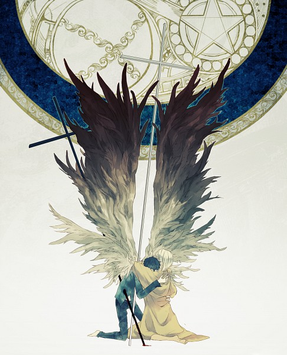

# Metatron

    cs      = require 'coffee-script'
    sys     = require 'sys'
    path    = require 'path'
    fs      = require 'fs'
    log     = console.log

    # Meta-data on this file stored with document in internal hash
    # object which allows extension and such.
    my = {
        filename:   __filename
        location:   __dirname
        extension:  path.extname path.resolve(__filename)
    }

    content = fs.readFileSync my.filename, 'utf-8'
    strout = String(fs.readFileSync my.filename)
    
    # Reverse literate Coffee-prose to ordinary comments
    log content
    log strout
    log cs.helpers.invertLiterate(content)
    log cs.compile content

> This Enoch, whose flesh was turned to flame, his veins to fire, his
eye-lashes to flashes of lightning, his eye-balls to flaming torches,
and whom God placed on a throne next to the throne of glory, received
after this heavenly transformation the name [Metatron][meta] ...

## Mythology

The myths of Metatron are extremely complicated, and at least two
[separate versions exist][ver]. Metatron's name is not clear although
many attempts have been made to explain it. None of them was
satisfactory, since *the word has no real meaning or root* in any
language. Some authors think it may be derived from private meditations
and visions, or even [glossolalia][glos].

Metatron is one of the most important angels in the heavenly hierarchy.
He is a member of a *special group* that is permitted to look at God's
countenance, an honor most angels do not share. In the literature,
Metatron is often referred to as "the Prince of the Countenance."

In the Babylonian Talmud, Metatron is mentioned only three times, but
the references are important. All three relate to the problem of
Metatron's *immense power*, which may have caused some people to confuse
him with God.

## Concrete

Metatron is an attempt to formalize and structure some patterns I had
applied when dealing with a multitude of node.js packages and the need
to impose some form of order upon these, as far as inclusion or meta-
programming/inspection of the API goes.

[meta]: <http://originalburn.com/kniccks/metatrons_cube_graph>
[wisp]: <https://github.com/Gozala/wisp>
[vers]: <http://www.pantheon.org/articles/m/metatron.html>
[glos]: <http://en.wikipedia.org/wiki/Glossolalia>

This problem will probably rely heavily on a [wisp][wisp] like DSL
should the need arise. Furthermore, tokenization takes place and trie-
structures are implemented with autocompletion to 'scan and absorb'
project source code. More later on the concept and theming around this
project.